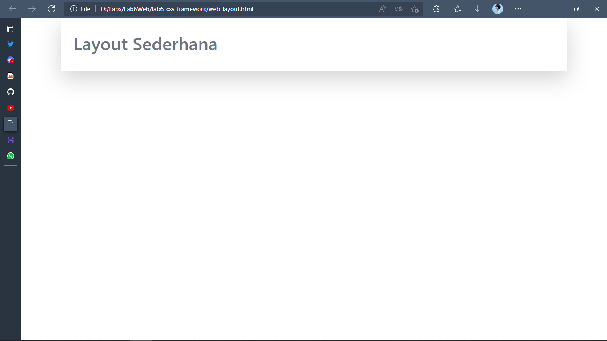

# Lab6Web

| INDIRA ALINE          |       312010042       |
|---------------------- |-----------------------|
|       TI.20.A.1       |   PEMROGRAMAN WEB     |
| PERTEMUAN 7           |   PRAKTIKUM 6         |

Dipertemuan kali ini akan mempelajari **Web FrameWork** dengan ***Bootstrap*** dalam membuat **layout**

## WEB FRAMEWORK BOOTSTRAP

## 1). MEMBUAT STRUKTUR DASAR DOKUMEN HTML

**PENJELASAN**

Dibawah adalah struktur Dasar Html menggunakan **Framework Bootstrap** Untuk menggunakan **Framework bootstrap** agar terhubung dengan Dokumen Html memerlukan **Link** yang sudah disediakan **bootstrap** dengan **link CDN** atau melalui **Online link** Seperti contoh salinan code dibawah.

**code html dan link bootstrap**
```html
<!doctype html>
<html lang="en">
  <head>
    <!-- Required meta tags -->
    <meta charset="utf-8">
    <meta name="viewport" content="width=device-width, initial-scale=1">
    <!-- Bootstrap CSS -->
    <link href="https://cdn.jsdelivr.net/npm/bootstrap@5.1.3/dist/css/bootstrap.min.css" rel="stylesheet" integrity="sha384-1BmE4kWBq78iYhFldvKuhfTAU6auU8tT94WrHftjDbrCEXSU1oBoqyl2QvZ6jIW3" crossorigin="anonymous">
    <title>Web Framework</title>
  </head>
  <body>
    <!-- Optional JavaScript; choose one of the two! -->
    <!-- Option 1: Bootstrap Bundle with Popper -->
    <script src="https://cdn.jsdelivr.net/npm/bootstrap@5.1.3/dist/js/bootstrap.bundle.min.js" integrity="sha384-ka7Sk0Gln4gmtz2MlQnikT1wXgYsOg+OMhuP+IlRH9sENBO0LRn5q+8nbTov4+1p" crossorigin="anonymous"></script>
    <!-- Option 2: Separate Popper and Bootstrap JS -->
    <!--
    <script src="https://cdn.jsdelivr.net/npm/@popperjs/core@2.10.2/dist/umd/popper.min.js" integrity="sha384-7+zCNj/IqJ95wo16oMtfsKbZ9ccEh31eOz1HGyDuCQ6wgnyJNSYdrPa03rtR1zdB" crossorigin="anonymous"></script>
    <script src="https://cdn.jsdelivr.net/npm/bootstrap@5.1.3/dist/js/bootstrap.min.js" integrity="sha384-QJHtvGhmr9XOIpI6YVutG+2QOK9T+ZnN4kzFN1RtK3zEFEIsxhlmWl5/YESvpZ13" crossorigin="anonymous"></script>
    -->
  </body>
</html>
```

## 2). MEMBUAT 

**PENJELASAN**

Membuat **Container** dengan **class container** **container** ini adalah container biasa di akan secara default hanya selebar **url** di atas layar atau tidak ukuran full **width** sementara untuk **class container-fluid** dia **full width 100%** itu perbedaan jenis **container** *dibootstrap* sudah terdesain otomatis hanya tinggal bagaiman kita membutuhkan nya,namun disini saya menggunakan **container** jenis biasa yang tidak **full width**.

**code html**
```html
 <!-- Container -->
    <div class="container">
    </div>
```

Di atas adalah contoh *class container* atau container yang saya gunakan sebagai wadah

## 3). MEMBUAT CARD 



**PENJELASAN**

Berikut hasil atau tampilan dari **Header** saya juga menambahkan **Box-Shadow-lg**  atau ***large*** dan juga padding atas bawah atau dalam **bootstrap** yaitu **py** dan juga beberapa class untuk membuat nya dan simpan **code** dalam ***body***

**code html**
```html
<!-- Container -->
    <div class="container shadow-lg">
        <div class="card-body">
            <h1 class="text-muted py-3">Layout Sederhana</h1>
        </div>
    </div>
```

## 4). MEMBUAT NAVIGASI 


**PENJELASAN**

Membuat Navigasi dengan **class "navbar"** **bootstrap** telah menyediakan semuanya hanya pada kita nya saja yang mendesain sesuai kebutuhan,seperti di atas memakai ***navigasi*** dengan **class navbar** dan beberapa class lainnya untuk mendukung navigasi nya seperti contoh **nav class active** di dalam element html di **bootstrap** dapat menggunakan banyak **class** dalam mendesain yang tersedia di bootstrap.

**code html**
```html
<nav class="navbar" style="background-color: #1f5faa;">
            <ul class="nav nav-pills">
                <li class="nav-item">
                    <a class="nav-link active text-light" aria-current="page" href="#">Home</a>
                </li>
                <li class="nav-item">
                    <a class="nav-link text-light" href="#">Article</a>
                </li>
                <li class="nav-item">
                    <a class="nav-link text-light" href="#">About</a>
                </li>
                <li class="nav-item">
                    <a class="nav-link text-light" href="#">Contact</a>
                </li>
            </ul>
</nav>
```

## 5).MEMBUAT CARD SECTION DESCRIPTION


**PENJELASAN**

Selanjutnya yaitu membuat **card body** dengan isi **section description** atau isi konten deskripsi saya menggunakan div dengan class card kemudian saya tambahkan inline css untuk sedikit mengatur sesuai layout nya dan juga menggunakan beberapa class di bootstrap nya seperti contoh gambar di atas.

**code html**
```html
<div class="card" style="width: 80,1rem; padding: 50px 20px; background-color: #e4e4e5; border-radius: 0;">
            <div class="card-body">
                <h1 class="card-title pb-4" style="font-weight: bold;">Hello World!</h1>
                <p class="card-text">Lorem ipsum dolor sit amet consectetur adipisicing elit. Voluptatem saepe
                    necessitatibus aspernatur nisi autem delectus excepturi nostrum natus similique beatae
                    reiciendis, quos placeat sapiente qui sint voluptatibus, a temporibus quasi.</p>
                <a href="#" class="btn btn-primary">Learn More »</a>
            </div>
</div>
```

## 6). MEMBUAT (CARD 1,CARD 2, CARD 3) DAN WIDGET DENGAN GRID ROW DAN COL

## CARD 1


**PENJELASAN**

Menambahkan CARD 1 dengan menggunakan **grid** **row** dan **col**  dan juga menggunakan beberapa ***class** dalam bootstrap 

**code html card 1**
```html
<!-- Row Content 1 -->
        <div class="row">
            <!-- card 1 -->
            <div class="col-3">
                <div class="col mt-4">
                    <div class="card" style="width: 18rem; border: 0;">
                        
                        <div class="card-body">
                            <h5 class="card-title">Heading</h5>
                            <p class="card-text">Lorem ipsum dolor sit, amet consectetur adipisicing elit. Voluptates,
                                facere.</p>
                            <a href="#" class="btn btn-primary">View detail</a>
                        </div>
                    </div>
                </div>
            </div>
        </div>
```

## CARD 2


**PENJELASAN**
Sama seperti di atas ini juga masih dalan row dan cuma col yang sama serta class yang sama

**code html card 2**
```html
<!-- card 2 -->
            <div class="col-3">
                <div class="col mt-4">
                    <div class="card" style="width: 18rem; border: 0;">
                        
                        <div class="card-body">
                            <h5 class="card-title">Heading</h5>
                            <p class="card-text">Lorem ipsum dolor sit amet consectetur adipisicing elit. Distinctio,
                                magnam?</p>
                            <a href="#" class="btn btn-primary">View detail</a>
                        </div>
                    </div>
                </div>
            </div>
```

## CARD 3


**PENJELASAN**

***Card 3*** juga sama seperti card lain nya masih dalam row dan col yang class yang sama seperti contoh gambar di atas 

**code html card 3**
```html
<!-- card 3 -->
            <div class="col-3">
                <div class="col mt-4">
                    <div class="card" style="width: 18rem; border: 0;">
                        
                        <div class="card-body">
                            <h5 class="card-title">Heading</h5>
                            <p class="card-text">Lorem ipsum dolor sit amet consectetur adipisicing elit. Nam, neque.
                            </p>
                            <a href="#" class="btn btn-primary">View detail</a>
                        </div>
                    </div>
                </div>
            </div>
```